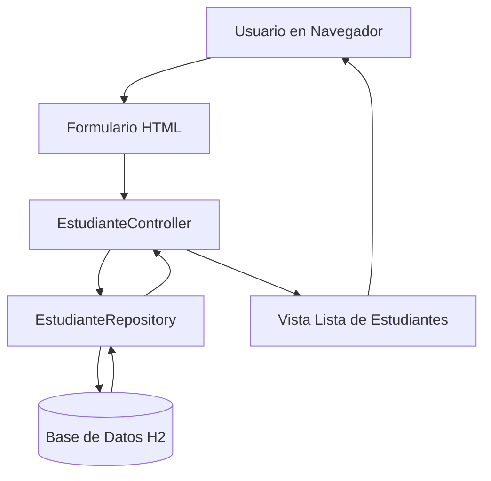

# Entrega - CRUD Estudiantes (Spring Boot)

## 1. Implementacion
Este modulo implementa los tres pilares solicitados:

- Modelo (`@Entity`): `Estudiante`
- Repositorio (`@Repository` + `JpaRepository`): `EstudianteRepository`
- Controlador (`@Controller`): `EstudianteController`

La inyeccion del repositorio en el controlador se realiza con `@Autowired`.

## 2. Flujo de trabajo solicitado
1. Usuario llena formulario en el navegador.
2. El controlador recibe la peticion HTTP.
3. El controlador delega el guardado al repositorio.
4. El repositorio persiste en la base de datos H2.
5. El controlador redirige a la lista para confirmar el resultado.

## 3. Diagrama de flujo

## 4. Endpoints
- `GET /estudiantes` -> Lista y busqueda
- `GET /estudiantes/nuevo` -> Formulario de alta
- `POST /estudiantes/guardar` -> Crear
- `GET /estudiantes/editar/{id}` -> Formulario de edicion
- `POST /estudiantes/actualizar/{id}` -> Actualizar
- `POST /estudiantes/eliminar/{id}` -> Eliminar

## 5. Ejecucion
1. Ejecutar: `./mvnw spring-boot:run` (Linux/Mac) o `mvnw.cmd spring-boot:run` (Windows)
2. Abrir: `http://localhost:8080/estudiantes`
3. Consola H2: `http://localhost:8080/h2-console`
   - JDBC URL: `jdbc:h2:mem:calculadora_db`
   - user: `sa`
   - password: vacio
